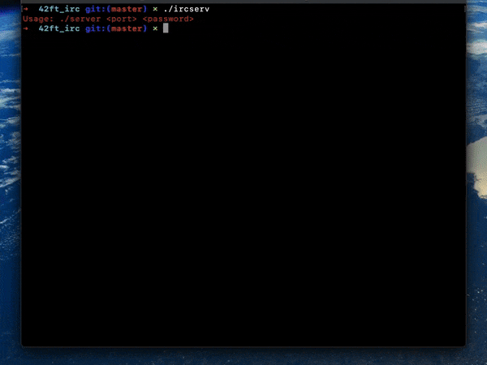

# 42ft_irc

## The old-school Discord server: an IRC server!

Connecting to the server with an **IRC client**, ***[irssi](https://en.wikipedia.org/wiki/Irssi)***:



**Internet Relay Chat** or **IRC** is a text-based communication protocol on the Internet.

The goal of this project is to build a fully functional **IRC server** from scratch, following the ***[RFC 2812](https://datatracker.ietf.org/doc/html/rfc2812)*** specifications, allowing multiple **IRC clients** to connect, join channels, and communicate in real-time, either publicly or privately.

The server accepts and handles connections from multiple clients using **sockets** and never hangs.
It supports private messaging and public chatrooms and enforces user authentication and nickname registration.
All **I/O** operations are **non-blocking** and the communication between client and server uses **TCP/IPv4**.

These commands are supported by the server:
  - ```PRIVMSG```: Sends a private message to a user or channel
  - ```INVITE``` : Invites a user to join a specific channel
  - ```NAMES```  : Lists the users in a channel or all visible users on the server
  - ```TOPIC```  : Sets or retrieves the topic of a channel
  - ```ERROR```  : Indicates an error message sent by the server
  - ```JOIN```   : Joins a user to a specified channel
  - ```KICK```   : Removes a user from a channel
  - ```MODE```   : Changes or queries channel/user modes (permissions or settings)
  - ```MOTD```   : Retrieves the "Message of the Day" from the server
  - ```NICK```   : Sets or changes the user's nickname
  - ```OPER```   : Grants operator (admin) privileges to a user
  - ```PART```   : Leaves a specified channel
  - ```PASS```   : Sends a password to authenticate with the server
  - ```PING```   : Tests the connection to the server or another client
  - ```PONG```   : Response to a ```PING``` command to keep the connection alive
  - ```QUIT```   : Disconnects from the server, optionally with a message
  - ```USER```   : Provides the username and real name during login

This my second to last project at **Hive Helsinki**. From this project I gained valuable knowledge and skills in **Network Programming**, **Protocol Implementation**, **Concurrency** and **Team Collaboration**.

## 📖 Topics
  - Object-oriented programming
  - Networking
  - Internet protocols
  - Concurrency and asynchronous I/O
  - Client-server architecture
  - Teamwork
  - Error handling and security
  - Parsing and string manipulation

## 🛠️ Langs/Tools
  - C++
  - Makefile

## 🦉 Getting started
See the above **GIF** for reference!

  1. ```git clone https://github.com/kenlies/42ft_irc```
  2. ```cd 42ft_irc```
  3. ```make```
  4. ```./ircserv <port> <password>```
  5. then on another terminal, open your favourite **IRC client**: ```irssi```
  6. connect to the server with: ```/connect 127.0.0.1 <port> <password>```
  7. ```/join <channel>``` to join a public room

## 💸 Bonus section

The bonus section added two features. One of them was file transfer, which was easy to implement due to the design of the ```PRIVMSG``` command—it worked almost out of the box. The other feature was a bot, which tells jokes and can leave when necessary. I know, such a useful bot!

## 🔨 To improve

The bot could've been made more useful. Better documentation and additional comments in code would be an improvement.
